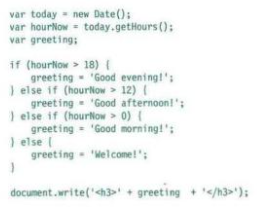

### From the Duckett HTML book:

#### Introduction (pp.2-11)
Read Summary pages in blue; then find the black pages and study them; then study the code and the examples; focus on understanding the concepts; 

#### HTML Chapter 1: “Structure” (pp.12-39)
HTML uses elements to describe the structure of pages; tags (elements) act like containers; they tell us sth about what lies between opening and end tag; `<p>text</p>`;

tags `<p attributes Name(lang) and Value(="en-us")>`; attributes tell us more about the element; they have a name and a value;

#### HTML Chapter 8: “Extra Markup” (p.176-199)
+ starts with !DOCTYPE html tells the browser you are using the latest version - ref basic structure - html (head, body(header(nav),main(section, article, aside),footer));
+ comments `<!--comment here-->` ignored by interpreter;
+ id (only 1 per page) and class (multiple times per page) attributes for element tags;
+ block elements take up all the space (per line) they can and cause a line break after;
+ inline elements snuggle up to before and after;
+ div tags group text and elements in a block;
+ span tags group text and elements inline;
+ iframes create a window in a window (think google maps);
+ meta tags add meta data - not displayed (think search optimization, keywords, robots; description that shows up in tab ontop);
+ escape characters (think `&copy; &lt; &gt;` )

#### HTML Chapter 17: “HTML5 Layout” (pp.428-451)
using new element tags vs just generic div - basic structure
html (head, body(header(nav),main(section (article(hgroup)),(article(hgroup)),aside(section)),footer));

#### HTML Chapter 18: “Process & Design” (pp.452-475)
+ it's important 2 understand who your target audience is (KEY QUESTIONS WHO page 455); why they would come 2 your site (KEY QUESTIONS WHY page 457); what info they want 2 find (KEY QUESTIONS WHAT page 458); and when and why they d return;(update roadmap/plan for the site/for pages/sections)
+ site maps allow u 2 plan the structure of the site; remember the visitor and her/his perspective is key, not the site owner; card sorting technique;
+ wireframes - a simple sketch of the key info that needs 2go on each page;
+ design is about communication;
+ visual hierarchy helps visitors 2 understand what u r trying 2 tell them;
+ u can differentiate between pieces of info using (think text) size, color and style (bold);
+ U can use grouping and similarity 2 help simplify the info u present; whitespace between unrelated items;

### From the Duckett JS book:

#### Introduction
+ JS allows to change the content of an html page while it is loaded in the browser; access, modify, program the rules/instructions, react to events triggered by user or browser;

#### JS Chapter 1: “The ABC of Programming” (pp.11-52)
#### A what is a script? How do I create one? for a webpage?
+ a script is like a resipes/handbook/manual - series of instructions that a computer follows to achieve a goal.
+ each time the script runs it might only use a subset of all the instructions
+ computers approach tasks in a different way than humans, so your instructions must let the computer solve the tasks programmatically
1. define the goal
1. design the script
1. code each step
flowchart on page 18 and another one on page 23;
learn to think how computers think - solving problems programmatically;


#### B how do computers fit in with the world around them ?
computers create models of the world using data;
objects can have their own:
+ properties (name and value);
+ events (triggered by user input or webpage itself);
+ methods (like a function - what interpreter does with objects);

webbrowsers create models of what they display - of the web page that are shown and of the window it is shown in;
the document object represents an html page;
using the document object, you can access and change what content users see on the page and respond to how they interact with it; that document object has properties, methods, events;
also creates a new object for each element on the page;
see the DOM document object model;

;

browser receives html code - creates a model of the page and stores it - it has a hierarchy (document - html - head - title+link,....) - elements, text, attributes... - it uses a rendering engine to show that page on the screen(CSS);

#### C How do I write a script for a webpage
layered - html - css - javascript; progressive enhancements;
;
```<script src="js/add-content.js"></scriptEND>;```
does NOT show in source code - but the link does to js file
```<script>document.write('<h3>Welcome!</h3>')</script>;```


