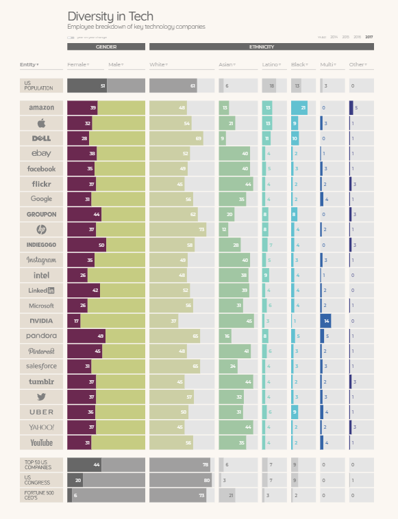

# Diversity and Inclusion

**_resources_**

Consider the history: [That Time When Women Stopped Coding](https://www.npr.org/sections/money/2014/10/21/357629765/when-women-stopped-coding)
buying computers in the 80s and 90s (maybe still today) used to be marketed and seen as toys for boys. Women missing out on early experience with computers. Stereotypes having big effects on society, politics, economy, life.
Review the data: [Employee breakdown of key technology companies](https://informationisbeautiful.net/visualizations/diversity-in-tech/)

### 

wow gotta look at these graphs - women in congress 7%
Ask the question: [Why diversity matters to your tech company](https://www.usatoday.com/story/tech/columnist/2015/07/21/why-diversity-matters-your-tech-company/30419871/)
more diverse teams bring more perspective to any effort. And therefore increase the bottom line. But also the quality of products, services and solutions.

[Back to ReadMe](../README.md)
