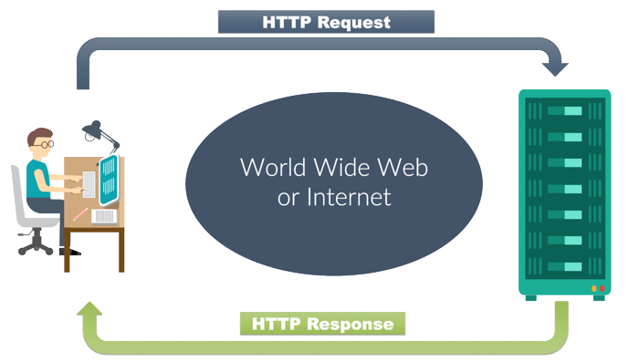

# Reading notes class 02

### What’s the difference between PUT and PATCH?

***https://rapidapi.com/blog/put-vs-patch/***

What is PUT?
PUT is a method of modifying resource where the client sends data that updates the entire resource. It is used to set an entity’s information completely. PUT is similar to POST in that it can create resources, but it does so when there is a defined URI. PUT overwrites the entire entity if it already exists, and creates a new resource if it doesn’t exist.

For example, when you want to change the first name of a person in a database, you need to send the entire resource when making a PUT request.

{“first": "John", "last": "Stone”}
To make a PUT request, you need to send the two parameters; the first and the last name.

What is PATCH?
Unlike PUT, PATCH applies a partial update to the resource.

This means that you are only required to send the data that you want to update, and it won’t affect or change anything else. So if you want to update the first name on a database, you will only be required to send the first parameter; the first name.

### Provide links to 3 services or tools that allow you to “mock” an API for development like json-server

- [https://www.mock-server.com/]
- [https://www.postman.com/features/mock-api/]
- [https://beeceptor.com/]
- [https://www.npmjs.com/package/fakerest]

### Compare and contrast Swagger and APIDoc.js 1 Which HTTP status codes should be sent with each type of (un)successful API call?

Common http status codes include:
404 - Not found
403 - Forbidden
500 - Server Error
mdn docs [https://developer.mozilla.org/en-US/docs/Web/HTTP/Status]

### Compare and contrast SOAP and ReST

[https://jelvix.com/wp-content/uploads/2020/09/soap-vs-rest-infographics-966x1384.jpg]

### Document the following Vocabulary Terms

- **_Web Server_**
  [wikipedia Server](https://en.wikipedia.org/wiki/Server_computing)
  A web server is computer software and underlying hardware that accepts requests via HTTP, the network protocol created to distribute web pages,[1] or its secure variant HTTPS. A user agent, commonly a web browser or web crawler, initiates communication by making a request for a specific resource using HTTP, and the server responds with the content of that resource or an error message. The server can also accept and store resources sent from the user agent if configured to do so.

A server can be a single computer, or even an embedded system such as a router with a built-in configuration interface, but high-traffic websites typically run web servers on fleets of computers designed to handle large numbers of requests for documents, multimedia files and interactive scripts. A resource sent from a web server can be a preexisting file available to the server, or it can be generated at the time of the request by another program that communicates with the server program. The former is often faster and more easily cached for repeated requests, while the latter supports a broader range of applications. Websites that serve generated content usually incorporate stored files whenever possible.

Technologies such as REST and SOAP, which use HTTP as a basis for general computer-to-computer communication, have extended the application of web servers well beyond their original purpose of serving human-readable pages.

- **_Express_**
  [wikipedia Express.js](https://en.wikipedia.org/wiki/Express.js)
  Express.js, or simply Express, is a back end web application framework for Node.js, released as free and open-source software under the MIT License. It is designed for building web applications and APIs.[3] It has been called the de facto standard server framework for Node.js.[4]

The original author, TJ Holowaychuk, described it as a Sinatra-inspired server,[5] meaning that it is relatively minimal with many features available as plugins. Express is the back-end component of popular development stacks like the MEAN, MERN or MEVN stack, together with the MongoDB database software and a JavaScript front-end framework or library.[6]

- **_Routing_**
  [wikipedia Routing](https://en.wikipedia.org/wiki/Routing)
  Routing is the process of selecting a path for traffic in a network or between or across multiple networks. Broadly, routing is performed in many types of networks, including circuit-switched networks, such as the public switched telephone network (PSTN), and computer networks, such as the Internet.

In packet switching networks, routing is the higher-level decision making that directs network packets from their source toward their destination through intermediate network nodes by specific packet forwarding mechanisms. Packet forwarding is the transit of network packets from one network interface to another. Intermediate nodes are typically network hardware devices such as routers, gateways, firewalls, or switches. General-purpose computers also forward packets and perform routing, although they have no specially optimized hardware for the task.

The routing process usually directs forwarding on the basis of routing tables. Routing tables maintain a record of the routes to various network destinations. Routing tables may be specified by an administrator, learned by observing network traffic or built with the assistance of routing protocols.

Routing, in a narrower sense of the term, often refers to IP routing and is contrasted with bridging. IP routing assumes that network addresses are structured and that similar addresses imply proximity within the network. Structured addresses allow a single routing table entry to represent the route to a group of devices. In large networks, structured addressing (routing, in the narrow sense) outperforms unstructured addressing (bridging). Routing has become the dominant form of addressing on the Internet. Bridging is still widely used within local area networks.

- **_WRRC_**
  [https://medium.com/@rachid1982fsb/what-is-http-5b01392678d5]
  

### Preview

- Which 3 things had you heard about previously and now have better clarity on?
  NPM, TDD and CI/CD pipeline through github and Heroku.
- Which 3 things are you hoping to learn more about in the upcoming lecture/demo?
  Test writing in relation to CI/CD
- What are you most excited about trying to implement or see how it works?
  Implementing tests using supertest and getting deeper into configuring github workflows from scratch.
