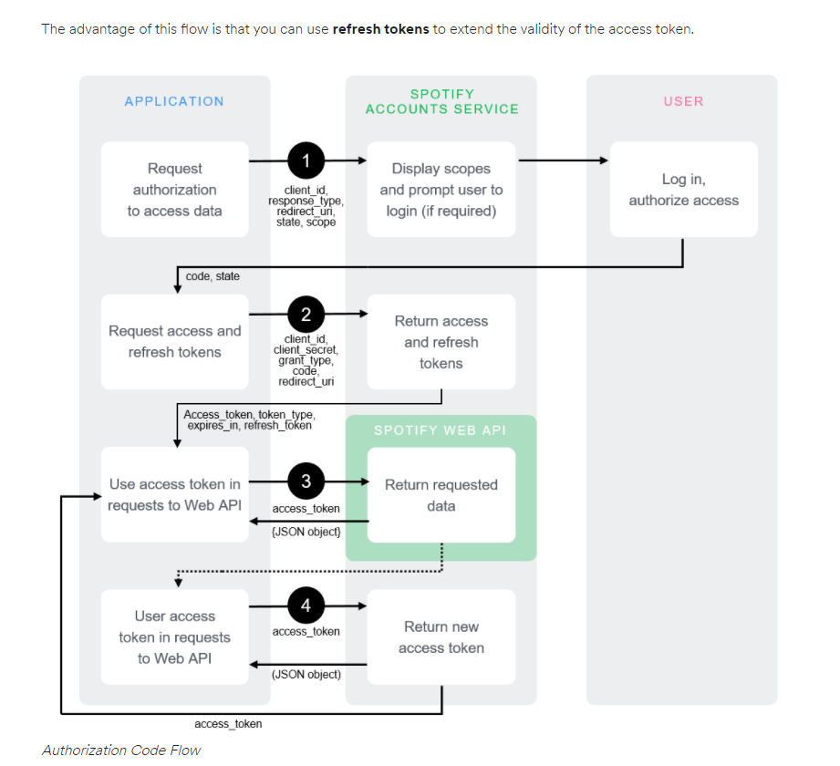

# Reading Class 07: Bearer Authorization

### + Write the following steps in the correct order:

1. Register your application to get a client_id and client_secret
1. Ask the client if they want to sign in via a third party
1. Redirect to a third party authentication endpoint
1. Receive access token
1. Make a request to the access token endpoint
1. Receive authorization code
1. Make a request to a third-party API endpoint

### + What can you do with an authorization code?

[investopedia](https://www.investopedia.com/terms/a/authorization-code.asp#:~:text=An%20authorization%20code%20is%20an,into%20a%20security%2Dprotected%20space.)

The most common usage of authorization codes is those sent to a merchant from credit card issuers, to confirm that the customer's credit card has sufficient credit available to authorize the transaction.

### + What can you do with an access token?

[oauth](https://www.oauth.com/oauth2-servers/access-tokens/#:~:text=Access%20tokens%20are%20the%20thing,in%20transit%20and%20in%20storage.)

Access tokens are the thing that applications use to make API requests on behalf of a user. The access token represents the authorization of a specific application to access specific parts of a user’s data.

### + What’s a benefit of using OAuth instead of your own basic authentication?

[clowder](https://www.clowder.com/post/why-your-organization-should-be-using-oauth-2.0#:~:text=Integrating%20OAuth%202.0%20into%20your,not%20interact%20with%20user%20credentials.)

- End user knows they are giving their credentials to a trusted site
- Multi-factor authentication can be used
- End user can revoke access for the app at anytime
- User can allow the 3rd party app to access only certain information from user account
- Flow is entirely standardized
- legal responsibility/ liability shield

### Document the following Vocabulary Terms
### + Client ID

[oauth](https://www.oauth.com/oauth2-servers/client-registration/client-id-secret/)

The client_id is a public identifier for apps. Even though it’s public, it’s best that it isn’t guessable by third parties, so many implementations use something like a 32-character hex string. It must also be unique across all clients that the authorization server handles. If the client ID is guessable, it makes it slightly easier to craft phishing attacks against arbitrary applications.

### + Client Secret

[oauth](https://www.oauth.com/oauth2-servers/client-registration/client-id-secret/)

The client_secret is a secret known only to the application and the authorization server. It must be sufficiently random to not be guessable. A great way to generate a secure secret is to use a cryptographically-secure library to generate a 256-bit value and converting it to a hexadecimal representation. 

### + Authentication Endpoint

[https://whatis.techtarget.com/definition/endpoint-authentication](https://whatis.techtarget.com/definition/endpoint-authentication)

Endpoint authentication is a security mechanism designed to ensure that only authorized devices can connect to a given network, site or service.

### + Access Token Endpoint

[oauth](https://www.oauth.com/oauth2-servers/access-tokens/)

The token endpoint is where apps make a request to get an access token for a user. This section describes how to verify token requests and how to return the appropriate response and errors.

### + API Endpoint

an endpoint is one end of a communication channel. When an API interacts with another system, the touchpoints of this communication are considered endpoints. For APIs, an endpoint can include a URL of a server or service.

### + Authorization Code

[investopedia](https://www.investopedia.com/terms/a/authorization-code.asp#:~:text=What%20Is%20an%20Authorization%20Code,into%20a%20security%2Dprotected%20space.)

An authorization code is an alphanumeric password that authorizes its user to purchase, sell or transfer items, or to enter information into a security-protected space.

### + Access Token

[oauth](https://www.oauth.com/oauth2-servers/access-tokens/#:~:text=Access%20tokens%20are%20the%20thing,in%20transit%20and%20in%20storage.)

Access tokens are the thing that applications use to make API requests on behalf of a user. The access token represents the authorization of a specific application to access specific parts of a user’s data.

Which 3 things had you heard about previously and now have better clarity on?
oAuth, Access Token, Authentication
Which 3 things are you hoping to learn more about in the upcoming lecture/demo?
oAuth, Access Token, Authentication
What are you most excited about trying to implement or see how it works?
oAuth, Access Token, Authentication

### resources
https://developer.okta.com/docs/reference/api/oidc/#composing-your-base-url

https://stackoverflow.com/questions/27301557/if-you-can-decode-jwt-how-are-they-secure

https://jwt.io/introduction/

https://www.youtube.com/watch?v=926mknSW9Lo
